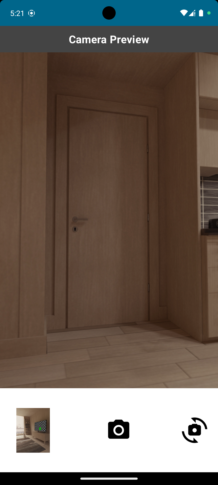

# Compose Basic Camera Sample Code

## Overview
This is the sample project for reference if I need to Compose Custom Camera View.



## Goal
- CameraX Custom View based on Compose
- Present preview and take a picture using CameraX
- Flip the camera to the front and Back
- get bitmap data from CameraX

## Build Environment

#### Android Studio

- Android Studio Hedgehog | 2023.1.1 Patch 1
- Build #AI-231.9392.1.2311.11255304, built on December 27, 2023

#### Android SDK

- Android SDK Build-Tools 35-rc2
- Android SDK Platform-Tools 34.0.5

#### Java

- Java Version: 17

#### Kotlin

- kotlin Version: 1.9.0

#### Compose Compiler

- Kotlin Compose Compiler: 1.5.1

#### Gradle

- Android Gradle Plugin Version: 8.1.2
- Gradle Version: 8.2

## Tech Stack

- Jetpack Compose
- MVI pattern
- Hilt
- Android CameraX
- Coil (추가 예정)

## Project Structure

Component의 기능 확인 목적의 샘플 코드로, presentation layer에 해당하는 `ui`패키지를 중심으로 구성되어 있습니다.

```agsl
├── BasicCamera.kt
├── MainActivity.kt
└── ui
```

#### UI Package

```agsl
└── ui
    ├── components
    │   ├── CameraComponent.kt
    │   ├── CameraComponentModel.kt
    │   └── CheckPermissionComponent.kt
    ├── screen.camera
    │   ├── CameraEvent.kt
    │   ├── CameraState.kt
    │   ├── CameraScreen.kt
    │   └── CameraViewModel.kt
    └── theme
```

- Screen의 경우 Compose의 원활한 구성을 위해 MVI 패턴을 바탕으로 구성하였습니다.
- CameraComponent는 Bitmap 후처리를 위한 viewModel을 가지고 있습니다.

## Function list

#### 1. Back Camera

- 후면 카메라(default)로 화면이 시작됩니다.
- 촬영 버튼을 누르면 사진이 촬영되고, 촬영한 사진이 화면에 표시됩니다.
- 전환 버튼을 누르면 전면 카메라로 전환됩니다.

  

<br>

#### 2. Front Camera

- 전면 카메라로 전환되면 화면이 시작됩니다.
- 촬영 버튼을 누르면 사진이 촬영되고, 촬영한 사진이 화면에 표시됩니다.
- 전환 버튼을 누르면 후면 카메라로 전환됩니다.

  

<br>
